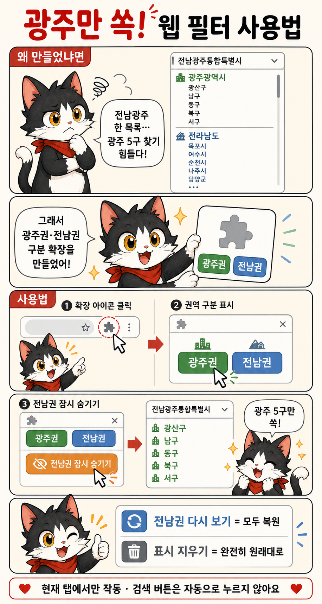

<div align="center">

# Hassle-Reduction-series-2-광주지명필터

### `전남광주통합특별시`로 합쳐진 지역 목록을 광주권 5개 구와 기존 전남권 22개 시·군으로 다시 알아보기 쉽게 나누는 Chrome·Edge 확장프로그램

[](https://github.com/obundh/Hassle-Reduction-series-2-Gwangju-Place-Name-Filter/releases/latest/download/Hassle-Reduction-series-2-Gwangju-Place-Name-Filter.zip)

GitHub가 차단되었거나 버튼 그림이 보이지 않으면 **[GitLab에서 최신 ZIP 받기](https://gitlab.aigov.go.kr/tyui22/Hassle-Reduction-series-2-Gwangju-Place-Name-Filter/-/releases/permalink/latest/downloads/Hassle-Reduction-series-2-Gwangju-Place-Name-Filter.zip)**를 누르세요.

**버튼 하나를 눌러 ZIP을 받은 뒤, 아래 순서대로 설치하면 됩니다.**

버전 `v0.4.0` · 로그인 불필요 · 현재 탭에서만 실행 · 페이지 내용을 외부로 전송하지 않음

</div>

> [!IMPORTANT]
> ZIP 파일을 클릭하는 것만으로는 설치되지 않습니다. 반드시 **압축을 먼저 풀고**, 압축을 푼 폴더를 Chrome 또는 Edge에서 한 번 불러와야 합니다.

## 1. 처음 설치하기 — 컴퓨터를 잘 몰라도 그대로 따라 하세요

### 1단계: ZIP 파일 받기

1. 이 문서 맨 위의 초록색 **GitHub 최신 ZIP 다운로드** 버튼을 누릅니다.
2. 회사·기관망에서 GitHub가 차단되었다면 바로 아래의 **GitLab에서 최신 ZIP 받기** 링크를 누릅니다.
3. 브라우저 오른쪽 위의 다운로드 아이콘을 누르거나, Windows의 **다운로드** 폴더를 엽니다.
4. 내려받은 파일 이름이 `Hassle-Reduction-series-2-Gwangju-Place-Name-Filter.zip`인지 확인합니다. 버전이 붙은 파일을 직접 받았다면 이름 끝에 `-v0.4.0.zip`이 표시될 수 있습니다.

### 2단계: ZIP 압축 풀기

1. 내려받은 ZIP 파일을 마우스 오른쪽 버튼으로 누릅니다.
2. Windows 11에서는 **모두 압축 풀기**, 다른 압축 프로그램에서는 **여기에 풀기** 또는 **압축 풀기**를 누릅니다.
3. 압축을 푼 폴더를 열어 `manifest.json`, `popup`, `src`가 보이는지 확인합니다.

> 폴더 안에 같은 이름의 폴더가 한 번 더 보이면 그 안쪽 폴더를 사용하세요. Chrome에서 선택할 폴더는 `manifest.json`이 바로 들어 있는 폴더입니다.

### 3단계: Chrome에 불러오기

1. Chrome 주소창에 `chrome://extensions`를 입력하고 Enter를 누릅니다.
2. 화면 오른쪽 위의 **개발자 모드** 스위치를 켭니다.
3. 왼쪽 위의 **압축해제된 확장 프로그램을 로드합니다** 버튼을 누릅니다.
4. 앞에서 압축을 푼 폴더 중 `manifest.json`이 들어 있는 폴더를 선택합니다.
5. 확장프로그램 카드에 **광주권·전남권 구분**이 나타나면 설치가 끝난 것입니다.

### 4단계: 확장 아이콘 고정하기

1. Chrome 주소창 오른쪽의 퍼즐 모양 **확장 프로그램** 아이콘을 누릅니다.
2. **광주권·전남권 구분** 오른쪽의 핀 아이콘을 누릅니다.
3. 이제 주소창 옆에 고정된 아이콘을 눌러 바로 사용할 수 있습니다.

### Edge를 사용하는 경우

Chrome과 거의 같습니다. 주소창에 `edge://extensions`를 입력하고 **개발자 모드 → 압축 풀린 항목 로드** 순서로 진행하세요.

## 2. 실제 사용법 — 두 버튼만 기억하면 됩니다

1. 지역 목록을 보고 싶은 웹페이지를 엽니다.
2. 사이트에 시·도 선택이 있다면 먼저 **전남광주통합특별시**를 선택합니다.
3. 주소창 옆에 고정한 확장 아이콘을 누릅니다.
4. 팝업의 **권역 구분 표시** 버튼을 누릅니다.
5. 광주 5개 구에는 초록색 `광주권`, 기존 전남 22개 시·군에는 파란색 `전남권` 표지가 붙습니다. 이 단계에서는 아무 항목도 숨기지 않습니다.
6. 광주 지역만 잠깐 보고 싶으면 **전남권 잠시 숨기기**를 누릅니다.
7. 닫혀 있던 시·군·구 드롭다운은 이 버튼을 누른 뒤 열어도 됩니다. 목록이 열린 뒤 잠시 기다리면 새 선택지도 자동으로 구분됩니다.

### 광주권만 남았을 때 보여야 하는 5개 구

`광산구` · `남구` · `동구` · `북구` · `서구`

### 원래 화면으로 되돌리는 방법

- **전남권 다시 보기**: 숨겼던 기존 전남 22개 시·군을 다시 표시합니다.
- **표시 지우기**: 확장프로그램이 붙인 모든 표지와 안내창을 제거하고 완전히 원래 화면으로 돌립니다.
- 페이지 새로고침: 현재 탭에 적용된 임시 표시가 사라집니다.

> [!NOTE]
> 확장프로그램은 검색 버튼을 대신 누르지 않습니다. 지역을 고른 뒤 실제 검색이 필요하면 사이트의 **검색** 버튼은 사용자가 직접 눌러야 합니다.

## 3. 만화로 한 번에 보기



## 4. 버튼과 색상의 의미

| 표시 또는 버튼 | 뜻 | 화면에서 일어나는 일 |
|---|---|---|
| `권역 구분 표시` | 먼저 누르는 기본 버튼 | 항목은 그대로 두고 광주권·전남권 표지만 붙임 |
| 초록색 `광주권` | 종전 광주광역시 | 광산구·남구·동구·북구·서구 |
| 파란색 `전남권` | 종전 전라남도 | 목포시·여수시·순천시 등 22개 시·군 |
| 보라색 `광주·전남` | 두 권역이 함께 명시됨 | 혼합 항목이므로 숨기지 않음 |
| `전남권 잠시 숨기기` | 광주 중심으로 잠깐 보기 | 판별된 전남권 항목만 임시로 접음 |
| `전남권 다시 보기` | 임시 숨김 해제 | 접었던 전남권 항목을 원래 위치에 복원 |
| `표시 지우기` | 확장 기능 종료 | 표지·색상·안내창을 모두 제거 |

## 5. 확인된 사이트별 사용법

### 주소정보누리집

대상: `https://www.juso.go.kr/ahu/ahuKarbSbdList`

1. 시·도에서 **전남광주통합특별시**를 선택합니다.
2. 확장에서 **권역 구분 표시 → 전남권 잠시 숨기기**를 차례로 누릅니다.
3. 시·군·구 목록을 엽니다.
4. 안내 선택지와 광주 5개 구만 남았는지 확인합니다.
5. 주소 결과를 바꾸려면 사이트의 **검색** 버튼을 직접 누릅니다.

PrimeVue처럼 드롭다운을 열 때마다 목록이 새로 만들어지는 사이트도 클릭·변경·키보드 열기 뒤 다시 확인합니다.

### 리치고

대상: `https://m.richgo.ai/pc`

- 지도 아래 현재 지역명을 눌러 지역 선택창을 엽니다.
- `전남광주` 아래 27개 시·군·구를 광주권 5개와 전남권 22개로 구분합니다.
- **전남권 잠시 숨기기**를 누르면 선택창에서 광주 5개 구를 빠르게 찾을 수 있습니다.
- 팝업의 광주 5구 바로가기 버튼은 사용자가 직접 누른 경우에만 해당 구로 이동합니다.
- 주소가 없는 지도 마커는 억지로 분류하지 않습니다.

### VMS 사회복지자원봉사인증관리

대상: `https://www.vms.or.kr/partspace/recruit.do`

- 결과 카드에는 세부 시·군·구 없이 `전남광주`만 표시되는 경우가 있어 카드 제목이나 기관명으로 추측하지 않습니다.
- 따라서 근거 없는 결과 카드는 **전남권 잠시 숨기기**를 눌러도 숨기지 않습니다.
- 팝업의 광주 5구 버튼을 누르면 VMS 공식 검색조건으로 한 구씩 다시 조회합니다.

## 6. 업데이트하는 방법

1. 이 문서 맨 위의 다운로드 버튼으로 새 ZIP을 받습니다.
2. 새 ZIP을 별도 폴더에 압축 풉니다.
3. `chrome://extensions` 또는 `edge://extensions`를 엽니다.
4. 기존 **광주권·전남권 구분** 카드에서 **삭제**를 누릅니다.
5. **압축해제된 확장 프로그램을 로드합니다**를 누르고 새로 압축을 푼 폴더를 선택합니다.
6. 확장 아이콘을 다시 고정하고, 사용 중이던 웹페이지도 새로고침합니다.

사용자 설정이나 계정 정보를 저장하지 않으므로 업데이트 전에 옮겨야 할 데이터는 없습니다.

## 7. 안 될 때 확인하기

### 드롭다운을 열었는데 전남 지역이 그대로 보입니다

1. 확장 아이콘을 다시 누릅니다.
2. **권역 구분 표시**가 적용되었는지 확인합니다.
3. **전남권 잠시 숨기기**를 누릅니다.
4. 드롭다운을 닫았다 다시 열고 잠시 기다립니다.
5. 그래도 안 되면 웹페이지를 새로고침한 뒤 다시 시도합니다.

### 확장 아이콘을 눌러도 실행되지 않습니다

- `chrome://`, `edge://` 같은 브라우저 내부 페이지에서는 실행할 수 없습니다.
- Chrome 웹스토어 페이지에서도 보안상 실행할 수 없습니다.
- PDF·이미지·Canvas/WebGL 안의 글자는 일반 웹 목록처럼 분류할 수 없습니다.
- iframe 또는 닫힌 Shadow DOM 안쪽은 사이트 구조에 따라 접근할 수 없습니다.

### 다른 도시의 동구·서구·남구·북구가 광주로 표시됩니다

현재 버전은 부산·대구·인천·대전·울산 등 다른 시·도 문맥을 우선 확인하고, `동구` 같은 이름만 단독으로 있으면 광주로 단정하지 않습니다. 재현되는 페이지가 있다면 주소와 화면 예시를 이 저장소의 Issue로 남겨주세요.

## 8. 개인정보와 권한

- 상시 모든 사이트를 읽는 권한을 요구하지 않습니다.
- 사용자가 확장 아이콘을 누른 현재 탭에서만 `activeTab`과 `scripting` 권한을 사용합니다.
- 페이지 내용·방문 주소·검색어·사용자 설정을 수집하거나 저장하지 않습니다.
- 외부 분석 서버, 광고, 추적 코드, 원격 실행 코드가 없습니다.
- VMS 구 버튼을 사용하면 현재 검색조건을 VMS의 같은 출처 공식 검색페이지로만 제출합니다.

## 9. 자동 판정 원칙과 한계

- `광주광역시 서구`, `전남광주통합특별시 북구`처럼 근거가 명확한 항목만 광주권으로 표시합니다.
- `전라남도 무안군`, `전남광주통합특별시 목포시`처럼 근거가 명확한 항목만 전남권으로 표시합니다.
- `경기도 광주시`를 광주권으로 오인하지 않습니다.
- `동구`, `서구`, `남구`, `북구` 단독처럼 다른 도시와 겹치는 이름은 주변 문맥이 없으면 표시하지 않습니다.
- `광주전남본부`처럼 주소가 아닌 조직명은 자동 판정하지 않습니다.
- 판별 근거가 부족하면 화면을 그대로 둡니다.

## 10. 개발자용 확인

필요 환경: Node.js 20 이상

```powershell
npm run check
npm run bundle
```

- `npm run check`: Manifest 권한·외부 전송 코드 부재·지역 분류 회귀 테스트 확인
- `npm run bundle`: 설치용 ZIP 생성
- `scripts/live-adapter-smoke.cjs`: Playwright가 있는 환경에서 범용 목록·주소정보누리집·리치고·VMS 실제 동작 확인

현재 공개 버전에서 확인한 항목:

- 지역 분류 단위 테스트 35개
- 동적 PrimeVue 드롭다운 28개 선택지: 광주권 5개·전남권 22개·안내 1개
- 네이티브 `<select>`의 선택값·선택 순서·폼 전송값 보존
- **전남권 다시 보기**와 **표시 지우기**의 원상복구
- 리치고 광주권 바로가기와 VMS 한 구씩 공식 재조회

## 라이선스

이 저장소의 확장프로그램 코드, 문서, 예시와 고양이 만화 이미지는 [MIT License](LICENSE)로 배포합니다.

- 개인·기관·상업 목적의 사용, 수정, 복제와 재배포가 가능합니다.
- 복사본이나 중요한 일부를 재배포할 때는 `LICENSE`의 저작권 표시와 허가문을 함께 남겨야 합니다.
- 프로그램은 별도 보증 없이 제공됩니다.
- `Chrome`, `Edge`, `리치고`, `VMS`, `주소정보누리집` 등 제3자 이름·로고·상표와 각 웹사이트의 콘텐츠 권리는 이 라이선스에 포함되지 않습니다.
- 이 확장프로그램은 해당 제3자 서비스가 제작·보증·후원한 공식 제품이 아닙니다.

전체 조건은 저장소의 [`LICENSE`](LICENSE) 파일에서 확인할 수 있습니다. 표준 식별자는 `MIT`입니다.
